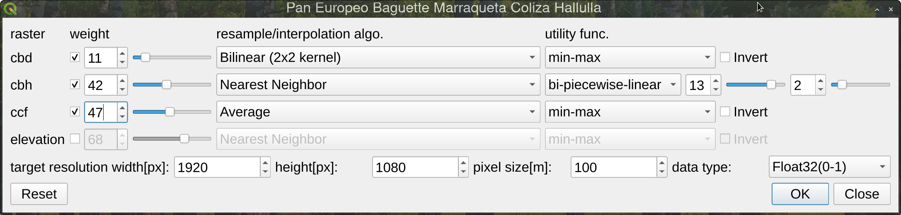
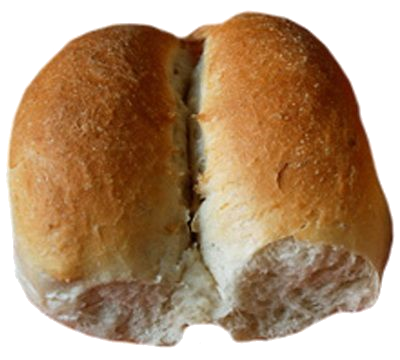

# Pan European Proof of Concept

- [Quick start](#quick-start)
- [How to use](#how-to-use)
  * [Raster configuration](#raster-configuration)
  * [Resampling methods](#resampling-methods)
- [About us](#about-us)

This QGIS plugin allows its users to calculate a summary cualitative raster from a set of large input rasters; by defining for each one its relative weight, utility attribute function parameters, and a resampling method.

Because the plugin is intended to process ~30 rasters at 100m pixel resolution (~30xGiB of data) a resampling method and target precision configuration is provided; Although the plugin can work with any available raster layers.

Contact the fire2a team for access to Erico's and TechnoSylva's rasters. We will be hosting them soon enough!



## Quick start
- Install QGIS (latest desktop version on qgis.org)
- On the QGIS menu, go to Plugins > Manage and Install Plugins 
- All (vertical tab on the left) > Search for "Pan European Proof of Concept" (top horizontal input) > Select the plugin (checkbox) > Click "Install" (bottom right)
- The plugin will be available on the "Plugins" section of the toolbar or on the "Plugins" menu, by clicking on the icon:
  
<div align="center">
    <table>
        <thead>
            <tr>
                <th>plugin icon</th>
            </tr>
        </thead>
        <tbody>
            <tr>
                <td></td>
            </tr>
        </tbody>
    </table>
</div>

## How to use
1. Open QGIS 
    - optional: setup any CRS in meters like EPSG:3857
    - optional: open the log panel (View > Panels > Log Messages) to read the plugin's progress on the "Marraqueta" tab
2. Load a set of raster layers
3. Click on the "Pan European Proof of Concept" plugin icon
4. Configure for each layer/row (see details [below](#raster-configuration))
5. Configure target raster creation (optional)
6. Buttons: 
```
Reset: to clear the dialog, load another set of layers
Cancel: to close the dialog and do nothing
Ok: to calculate a new layer
```
7. (FIXME) Export the new layer as a pdf or png file (right click on the layer > Export > Save as Image)

### Raster configuration
For each available layer (must be local and written to disk) available configurations are:
1. Layer enable/disable checkbox
2. Weight attributes as spinbox & slider (they get adjusted to sum 100 at run time)
3. Resample method combobox selector (see details [below](#resampling-methods))
4. Utility function configuration, select between:  
   a. Min-Max scaling  
   b. Max-Min scaling, same but inverted  
   c. Bi-Piecewise-Linear Values, with its two breakpoint setup as data real values  
   d. Bi-Piecewise-Linear Percentage, with its two breakpoint setup percentage values from real data range (data.max - data.min)  
5. Target raster creation setup:
   - By default setup to create a "HD (1920x1080 pixels) image with each pixel representing an hectare (100x100m) pixel size" to speed up the processing
   - Except when the zoom level is so high that the shown data is smaller than HD. In that case, the target raster will have the same resolution as the original raster in the actual viewport
   - Currently the algorithm will get confused if the shown raster is not in a squared meters projection CRS
   - Currently the datatype configuration is untested

### Resampling methods
Each target raster is expected to have billion pixels and the resampling method is crucial to the final result in a reasonable time. The following methods are available:

    Nearest Neighbor:
        This is the default and fastest algorithm.
        It assigns the value of the closest pixel in the original raster to the corresponding pixel in the output array.
        This method can introduce sharp edges and blockiness in the resampled image.

    Bilinear:
        This method considers the four nearest neighboring pixels in the original raster.
        It calculates a weighted average of their values based on their distance to the new pixel location in the output array.
        Bilinear interpolation produces smoother results compared to nearest neighbor but may introduce some blurring.

    Cubic:
        This method involves a 4x4 neighborhood of pixels in the original raster.
        It uses a polynomial function to interpolate a new value for the output pixel based on the values of surrounding pixels.
        Cubic interpolation provides smoother results than bilinear but is computationally more expensive.

    Cubic Spline:
        This method uses cubic spline interpolation, which is a more advanced technique compared to regular cubic interpolation.
        It offers smoother results but is even more computationally intensive.

    Lanczos:
        This method employs a Lanczos filter for interpolation, known for its good preservation of high-frequency details.
        It can be computationally expensive but may be preferred for resampling imagery with sharp edges or fine details.

    Average:
        This method calculates the average value of all neighboring pixels in the original raster and assigns it to the output pixel.
        It can be useful for smoothing noisy data but may blur sharp features.

    Mode:
        This method assigns the value that appears most frequently among the neighboring pixels in the original raster to the output pixel.
        It can be useful for categorical data but may not be suitable for continuous datasets.

    Gauss:
        This method utilizes a Gaussian distribution to weight the values of neighboring pixels in the original raster.
        It can be useful for datasets with continuous variation but is less common than other resampling methods.

# About us

| Role | Where | Method |
| --- | --- | --- | 
| Outreach |  https://www.fire2a.com | fire2a@fire2a.com | 
| User docs |  https://fire2a.github.io/docs/ | github-issues "forum" |
| Algorithms docs |  https://fire2a.github.io/fire2a-lib/ | Pull Requests |
| Developer docs |  https://www.github.com/fire2a | Pull Requests |

Developed by fdobad.82 @ [Signal App](https://signal.org)
