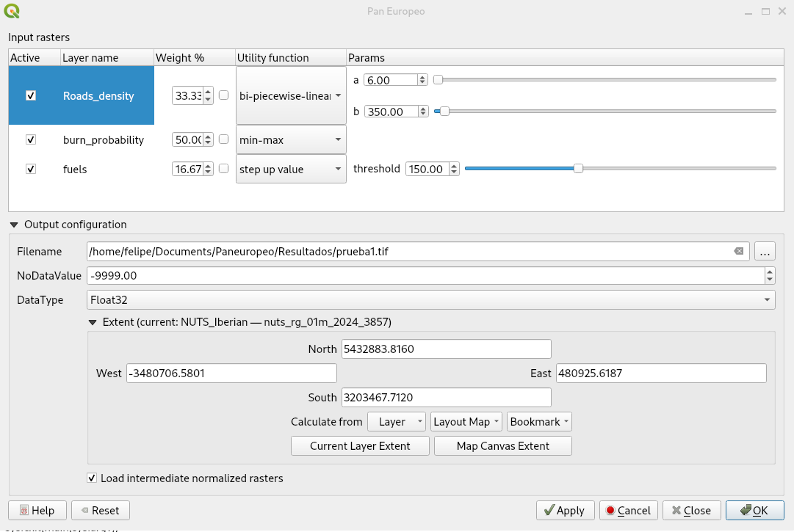

#  Pan European Proof of Concept 

- [Quick start](#quick-start)
- [How to use](#how-to-use) 
  * [Raster configuration](#raster-configuration)
  * [Resampling methods](#resampling-methods)
- [About us](#about-us)

This QGIS plugin allows its users to priorize resources based in several variables with different units (e.g. population density, fuel load, etc.). It works by defining the relative weight of each variable and the utility attribute function and its parameters to standerize all variables. It also allows to define the extent of the analysis.    
Users should define the variables to include, its relative weight, its utility attribute function and its parameters to standerize their values. In these ways, the user can compare variables with different units.

| Interface with Advanced Options Enabled |
| --- |
||

## Quick start
- Install QGIS (latest desktop version on qgis.org)
- On the QGIS menu, go to Plugins > Manage and Install Plugins
- Enable experimental Plugins on Settings section     
- All (vertical tab on the left) > Search for "Pan European Proof of Concept (Pan Europeo)" in the top horizontal search bar > Select the plugin (checkbox) > Click "Install" (bottom right)
- The plugin will be available on the "Plugins" section of the toolbar or on the "Plugins" menu, by clicking on the icon:
  
<div align="center">
    <table>
        <thead>
            <tr>
                <th>plugin icon</th>
            </tr>
        </thead>
        <tbody>
            <tr>
                <td></td>
            </tr>
        </tbody>
    </table>
</div>

## How to use
1. Open QGIS 
    - optional: setup any CRS in meters like EPSG:3857, preferably the same SRC as your raster layers.
    - optional: open the log panel (View > Panels > Log Messages) to read the plugin's progress on the "PanEuropeo" tab.
2. Load a set of raster layers
3. [Optional] Load a Polygon to represent the area of study.
4. [Optional] Select a polygon feature to define the area of study (else the visible area will be used).
3. Click on the "Pan European" plugin icon.
4. Configure for each layer/row (see details [below](#raster-configuration))
5. Configure target raster creation (only for advanced options mode).  
   a. Filename: name and place where you will save the resulting layer (prioritization). If it is empty a temporary file will be generated.  
   b. NoDataValue: Value to be used for pixels with no data. If it is empty...  
   c. DataType: Data Type to be used for the resulting layer (prioritization).  
7. Buttons: 
```
Reset: to clear the dialog, load another set of layers.
Cancel: to close the dialog and do nothing.
Ok: to calculate and get the results (priorization).
```
After clicking "Ok" calculations will begin.  
Then a new, randomly named GTiff raster, will be written into your temporal files.  
It can be easily export as a pdf, png or other format by right click on the layer > Export > Save as [Image]  

### Raster configuration
For each available layer (must be local and written to disk) available configurations are:
1. Layer enable/disable checkbox
2. Weight attributes as spinbox & slider (they get adjusted to sum 100 at run time)
3. Utility function configuration, select between:  
   a. Min-Max scaling  
   b. Max-Min scaling, same but inverted  
   c. Bi-Piecewise-Linear Values, with its two breakpoint setup as data real values  
   d. Bi-Piecewise-Linear Percentage, with its two breakpoint setup percentage values from real data range (data.max - data.min)  
   e. Step-Up function, with a single breakpoint setup as data real value  
   f. Step-Up function, with a single breakpoint setup as percentage  
   g. Step-Down function, with a single breakpoint setup as data real value  
   h. Step-Down function, with a single breakpoint setup as percentage  


Notice that for the Bi-Piecewise-Linear functions (c. and d.) crossing the breakpoints will invert the function's slope.  
Also in the case that one of them being zero (or minimun observation) a flat part is removed, e.g., `a=0 and b>0`:


You get up-slope and flat. Conversely, if `b=0 and a>0`, the graph will be reflected the vertically (as c. and d.), getting flat and down-slope.  
Finally by one of them being 1 (or maximun observation) instead of 0, you get the other flat part removed.
If you choose to use the real values, please note that you may have to wait for Qgis to load the real values in the parameters section.

5. [Advanced] Target raster creation setup:
   - If enabled, by default, creates a HD (1920x1080 pixels) image with each pixel representing an hectare (100x100m) pixel size; this values can be adjusted. With a trade-off on the final raster size and processing time.
   - When the zoom level is so high that the shown data is smaller than the configured output raster, the configuration is ignored and the target raster will have the same resolution as the raster in the actual viewport

### Known issues
- The algorithm can get confused if the shown raster is not in a squared meters projection CRS
- Currently different datatypes than Float-32 is untested

### Resampling methods
Each target raster is expected to have billion pixels and the resampling method is crucial to the final result in a reasonable time. The following methods are available:

    Nearest Neighbor:
        This is the default and fastest algorithm.
        It assigns the value of the closest pixel in the original raster to the corresponding pixel in the output array.
        This method can introduce sharp edges and blockiness in the resampled image.
        Probably the most used method for categorical rasters.

    Bilinear:
        This method considers the four nearest neighboring pixels in the original raster.
        It calculates a weighted average of their values based on their distance to the new pixel location in the output array.
        Bilinear interpolation produces smoother results compared to nearest neighbor but may introduce some blurring.
        Probably the most used method in rasters with continuous data.

    Cubic:
        This method involves a 4x4 neighborhood of pixels in the original raster.
        It uses a polynomial function to interpolate a new value for the output pixel based on the values of surrounding pixels.
        Cubic interpolation provides smoother results than bilinear but is computationally more expensive.

    Cubic Spline:
        This method uses cubic spline interpolation, which is a more advanced technique compared to regular cubic interpolation.
        It offers smoother results but is even more computationally intensive.

    Lanczos:
        This method employs a Lanczos filter for interpolation, known for its good preservation of high-frequency details.
        It can be computationally expensive but may be preferred for resampling imagery with sharp edges or fine details.

    Average:
        This method calculates the average value of all neighboring pixels in the original raster and assigns it to the output pixel.
        It can be useful for smoothing noisy data but may blur sharp features.

    Mode:
        This method assigns the value that appears most frequently among the neighboring pixels in the original raster to the output pixel.
        It can be useful for categorical data but may not be suitable for continuous datasets.

    Gauss:
        This method utilizes a Gaussian distribution to weight the values of neighboring pixels in the original raster.
        It can be useful for datasets with continuous variation but is less common than other resampling methods.

# About us

| Role | Where | Method |
| --- | --- | --- | 
| Outreach |  https://www.fire2a.com | fire2a@fire2a.com | 
| User docs |  https://fire2a.github.io/docs/ | github-issues "forum" |
| Algorithms docs |  https://fire2a.github.io/fire2a-lib/ | Pull Requests |
| Developer docs |  https://www.github.com/fire2a | Pull Requests |

Developed by fdobad.82 @ [Signal App](https://signal.org)
Branding & testing by Felipe De La Barra felipedelabarra@fire2a.com 
