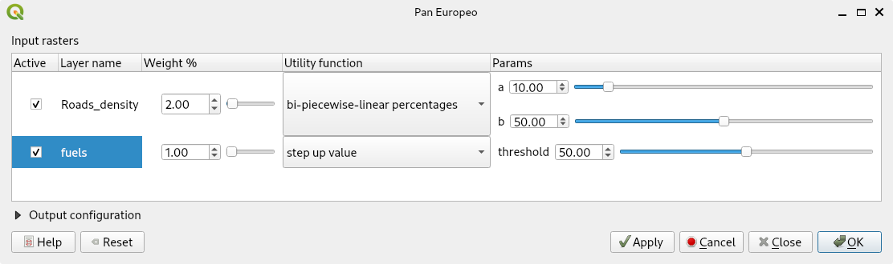

#  Pan European Proof of Concept 

- [Quick start](#quick-start)
- [How to use](#how-to-use) 
  * [Raster configuration](#raster-configuration)
- [About us](#about-us)

This QGIS plugin allows its users to priorize resources based in several variables with different units (e.g. population density, fuel load, etc.). It works by defining the relative weight of each variable and the utility attribute function and its parameters to standerize all variables. It also allows to define the extent of the analysis.    
Users should define the variables to include, its relative weight, its utility attribute function and its parameters to standerize their values. In these ways, the user can compare variables with different units. 

| Basic User Interface | Interface with Advanced Options Enabled |
| --- | --- |
|||

## Quick start
- Install QGIS (latest desktop version on qgis.org)
- On the QGIS menu, go to Plugins > Manage and Install Plugins
- Enable experimental Plugins on Settings section     
- All (vertical tab on the left) > Search for "Pan Europeo" in the top horizontal search bar > Select the plugin (checkbox) > Click "Install" (bottom right). Also install "Pan Europeo Processing" plugin repeating the last two steps.
- The plugin will be available on the "Plugins" section of the toolbar or on the "Plugins" menu, by clicking on the icon:
  
<div align="center">
    <table>
        <thead>
            <tr>
                <th>plugin icon</th>
            </tr>
        </thead>
        <tbody>
            <tr>
                <td></td>
            </tr>
        </tbody>
    </table>
</div>

## How to use
1. Setup QGIS Project  
    a. setup the project CRS to EPSG:3857, the same SRC as your raster layers.  
    b. [Optional] open the log panel (View > Panels > Log Messages) to read the plugin's progress on the "PanEuropeo" tab.  
2. Load a set of raster layers. Layers must be local and written to disk.  
3. [Optional] Load a Polygon containing the study area.
4. Save the project.  
5. Click on the "Pan European" plugin icon.
6. [Optional] Select a polygon feature to define the area of study (else the visible area will be used).
7. Configure for each layer/row (see details [below](#raster-configuration))
8. [Optional] Configure target raster creation (only for advanced options mode).  
   a. Filename: name and place where you will save the resulting layer (prioritization). If it is empty a temporary file will be generated.  
   b. NoDataValue: Value to be used for pixels with no data.  
   c. DataType: Data Type to be used for the resulting layer (prioritization).  
9. Buttons: 
```
Help: Open this user manual.
Reset: to clear the dialog, load another set of layers.
Apply: redistributes the weights values so that they add up to 100
Cancel: to close the dialog and do nothing.
Ok: to calculate and get the results (priorization).
```
After clicking "Ok" calculations will begin.  
Then a new, randomly named GTiff raster, will be written into your temporal files.  
It can be easily export as a pdf, png or other format by right click on the layer > Export > Save as [Image]  

### Raster configuration
For each available layer (must be local and written to disk) available configurations are:
1. Layer enable/disable checkbox
2. Weight attributes as spinbox & slider (they get adjusted to sum 100 at run time)
3. Utility function configuration, select between:  
   a. Min-Max scaling.  
   b. Max-Min scaling, same but inverted  
   c. Bi-Piecewise-Linear Values, with its two breakpoint setup as data real values  
   d. Bi-Piecewise-Linear Percentage, with its two breakpoint setup percentage values from real data range (data.max - data.min)  
   e. Step-Up value function, with a single breakpoint setup as data real value  
   f. Step-Up percentage function, with a single breakpoint setup as percentage  
   g. Step-Down value function, with a single breakpoint setup as data real value  
   h. Step-Down percentage function, with a single breakpoint setup as percentage  


Notice that for the Bi-Piecewise-Linear functions (c. and d.) crossing the breakpoints will invert the function's slope.  
Also in the case that one of them being zero (or minimun observation) a flat part is removed, e.g., `a=0 and b>0`:


You get up-slope and flat. Conversely, if `b=0 and a>0`, the graph will be reflected the vertically (as c. and d.), getting flat and down-slope.  
Finally by one of them being 1 (or maximun observation) instead of 0, you get the other flat part removed.  
**If you choose to use the real values, please note that you may have to wait for Qgis to load the real values in the parameters section.**

### Known issues
- The algorithm can get confused if the shown raster is not in a squared meters projection CRS
- Currently different datatypes than Float-32 is untested

# About us

| Role | Where | Method |
| --- | --- | --- | 
| Outreach |  https://www.fire2a.com | fire2a@fire2a.com | 
| User docs |  https://fire2a.github.io/docs/ | github-issues "forum" |
| Algorithms docs |  https://fire2a.github.io/fire2a-lib/ | Pull Requests |
| Developer docs |  https://www.github.com/fire2a | Pull Requests |

Developed by fdobad.82 @ [Signal App](https://signal.org)
Branding & testing by Felipe De La Barra felipedelabarra@fire2a.com 
